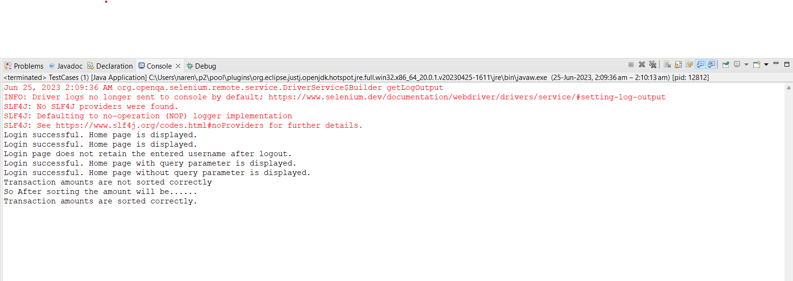

<h1 align="center">Intership Task</h1>
<h2>Task</h2>
<p>Writing the Automation scripts using Selenium Web Driver for given website</p>
<a href="https://sakshingp.github.io/assignment/login.html">https://sakshingp.github.io/assignment/login.html</a>

### Login Page

- Test Scenario: Cover all possible functional testing scenarios.
- Description: Verify the functionality of the Login Page with different combinations of valid and invalid usernames/passwords.
- Steps to Reproduce:
    1. Open the application login page.
    2. Enter a valid username/password combination and click the Login button.
    3. Verify that the user is successfully logged in and redirected to the Home Page.
    4. Repeat the above steps with valid and invalid username/password combinations.
- Expected Result: The Login Page should allow access with valid credentials and redirect to the home page

### Home Page

- Test Scenario: Verify the sorting functionality of the transaction table.
- Description: After successful login, check if clicking the AMOUNT header in the transaction table results in the sorting of values.
- Steps to Reproduce:
    1. log in to the application using valid credentials.
    2. Verify that the user is successfully logged in and redirected to the Home Page.
    3. Locate and click the AMOUNT header in the transaction table.
    4. Verify that the transaction values in the table are sorted in ascending or descending order based on the clicked header.
- Expected Result: Clicking the AMOUNT header should trigger the sorting of transaction values in the table, with the values displayed in the expected order.

## LoginPage ([LoginPage.java](https://github.com/Narendar14082000/TestingWebsite/blob/master/src/com/example/tests/pages/LoginPage.java))

The LoginPage class represents the login page of the application. It provides methods to interact with the login form, enter a username and password, and perform login actions.

#### Constructor

- `LoginPage(WebDriver driver)`: Constructs a new LoginPage object.
    - Parameters:
        - `driver`: The WebDriver instance to use for interacting with the web elements.

#### Methods

- `enterUsername(String username)`: Enters the specified username into the username input field.
- `enterPassword(String password)`: Enters the specified password into the password input field.
- `clickLoginButton()`: Clicks the login button.
- `getUsername()`: Retrieves the entered username from the username input field.

These methods can be used to automate the login process in the application and perform functional testing scenarios.

##### Usage

```java
// Create an instance of the LoginPage
LoginPage loginPage = new LoginPage(driver);

// Enter the username and password
loginPage.enterUsername("john@example.com");
loginPage.enterPassword("password123");

// Click the login button
loginPage.clickLoginButton();

// Retrieve the entered username
String enteredUsername = loginPage.getUsername();
System.out.println("Entered username: " + enteredUsername);

Retrieves the entered username from the username input field.
- Returns: The entered username.
```

## HomePage ([HomePage.java](https://github.com/Narendar14082000/TestingWebsite/blob/master/src/com/example/tests/pages/HomePage.java))

The HomePage class represents the home page of the application. It provides methods to interact with elements on the home page, such as sorting the transaction table by the "Amount" header and retrieving the transaction amounts.

#### Constructor

- `HomePage(WebDriver driver)`: Constructs a new HomePage object.
    - Parameters:
        - `driver`: The WebDriver instance to use for interacting with the web elements.

#### Methods

- `clickAmountHeader()`: Clicks the "Amount" header to sort the transaction table.
- `getTransactionAmounts()`: Retrieves the transaction amounts from the table and returns them as a list of doubles.

These methods can be used to automate interactions with the home page and perform functional testing scenarios, such as verifying the sorting of transaction amounts.

##### Usage

```java
// Create an instance of the HomePage
HomePage homePage = new HomePage(driver);

// Click the "Amount" header to sort the transaction table
homePage.clickAmountHeader();

// Retrieve the transaction amounts
List<Double> transactionAmounts = homePage.getTransactionAmounts();

// Print the transaction amounts
System.out.println("Transaction Amounts:");
for (Double amount : transactionAmounts) {
    System.out.println(amount);
}
```

## TestCases ([TestCases.java](https://github.com/Narendar14082000/TestingWebsite/blob/master/src/com/example/tests/tests/TestCases.java))

The TestCases class contains test cases for a web application. It utilizes the LoginPage and HomePage page objects to perform various functional testing scenarios.

#### Constructor

- `TestCases()`: Constructs a new TestCases object.

#### Methods

- `setUp()`: Sets up the WebDriver and initializes the page objects.
- `waitTime()`: Pauses the execution for a specified amount of time.
- `testLoginPage()`: Tests the login functionality by entering the username and password, clicking the login button, and checking if the user is redirected to the home page.
- `testRememberMeFunctionality()`: Tests the "Remember Me" functionality by entering valid credentials, checking the "Remember Me" checkbox, clicking the login button, logging out, and verifying if the entered username is retained on the login page.
- `testNavigationWithQueryParameters()`: Tests navigation to the home page with query parameters by entering valid credentials, clicking the login button, and checking if the user is redirected to the home page with the query parameter retained.
- `testNavigationWithoutQueryParameters()`: Tests navigation to the home page without query parameters by entering valid credentials, clicking the login button, and checking if the user is redirected to the home page without any query parameters.
- `testHomePageSorting()`: Tests the sorting functionality on the home page by navigating to the home page, clicking the "Amount" header to sort the transaction table, retrieving the sorted transaction amounts, creating a copy of the amounts and sorting it in ascending order, and comparing the sorted amounts with the expected sorted amounts.
- `tearDown()`: Tears down the WebDriver and closes the browser.
- `main(String[] args)`: The main method to execute the test cases.

These methods can be used to automate functional testing scenarios on the web application, covering login functionality, "Remember Me" functionality, navigation with query parameters, and sorting on the home page.

##### Usage

```java
// Create an instance of the TestCases class
TestCases testCases = new TestCases();

// Set up the WebDriver and initialize page objects
testCases.setUp();

// Execute the test cases
testCases.testLoginPage();
testCases.waitTime();
testCases.testRememberMeFunctionality();
testCases.waitTime();
testCases.testNavigationWithQueryParameters();
testCases.waitTime();
testCases.testNavigationWithoutQueryParameters();
testCases.waitTime();
testCases.testHomePageSorting();
testCases.waitTime();

// Tear down the WebDriver and close the browser
testCases.tearDown();
```
## Test Case Execution Output

The following is the summary of the test case execution:

- The driver logs are no longer sent to the console by default. You can refer to [this link](https://www.selenium.dev/documentation/webdriver/drivers/service/#setting-log-output) for more details.
- The SLF4J logging framework was not found, so a default no-operation (NOP) logger implementation is used. You can find further details [here](https://www.slf4j.org/codes.html#noProviders).
- The login functionality was successfully tested, and the home page was displayed upon successful login.
- The "Remember Me" functionality was tested, and it was observed that the login page does not retain the entered username after logout.
- Navigation to the home page with query parameters was successfully tested, and the home page with the query parameter was displayed.
- Navigation to the home page without query parameters was successfully tested, and the home page without any query parameter was displayed.
- The sorting functionality on the home page was tested, and it was verified that the transaction amounts are sorted correctly.

Please refer to the implementation screenshots section below for visual representations of the test case execution.




